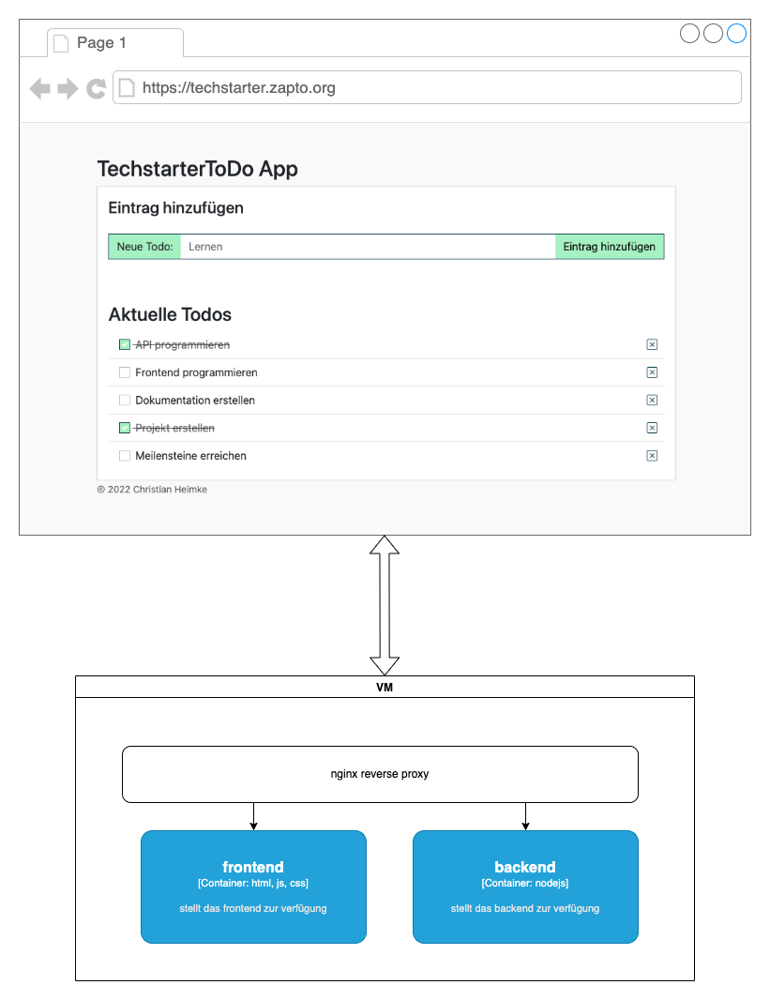
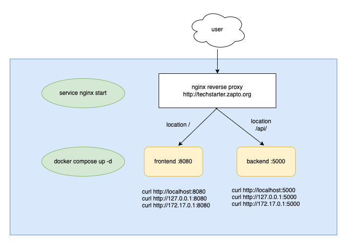

# demo reverse proxy backend

## Setup

* Bitte Sicherstellen, dass folgende Komponenten auf der VM verfügbar sind:
  *  docker
  *  docker-compose

## Ausgangssituation

* Es existiert ein funktionsfähiges Docker-Image für das Frontend
  * in diesem Beispiel heißt es `christianheimke/demo-frontend-nodejs:001`
* Es existiert ein funktionsfähiges Docker-Image für das Backend
  * in diesem Beispiel heißt es `christianheimke/demo-backend-nodejs:001`
* Die `docker-compose.yml` Datei enthält drei Dienste: Frontend und Backend

## Aufbau und Funktionsweise



* Anfragen gehen an eine Domain (techstarter.zapto.org)
* Anfragen werden vom nginx auf dem Server entgegen genommen
* Der nginx _entscheidet_ anhand des Pfads (`location`) welcher Container die Anfrage bekommt
### Installation

* docker compose datei anlegen und eigene Container für das frontend und backend konfigurieren
  (siehe `docker-compose.yml`)
* container starten
  `sudo docker compose up -d`
* nginx auf dem server installieren
  `sudo apt install nginx`
* nginx konfigurieren
  `sudo nano /etc/nginx/sites-enabled/zapto.org.conf`
* siehe unten, konfiguration übernehmen (variante 1 oder 2)
* nginx Konfiguration prüfen
  `sudo nginx -t`
* wenn alles OK ist (return code 0), nginx neustarten:
  `sudo nginx -s reload`
* domain aufrufen

### reverse proxy



### Konfiguration

#### Variante I

siehe `data/variante_1/zapto.org.conf`

```
# upstream server (service) defininieren für das frontend
upstream frontend {
    server localhost:8080;
}

# upstream server (service) defininieren für das backend
upstream backend {
    server localhost:5000;
}

server {
    # http port
    listen 80;
    listen [::]:80;

    # servername / domain name
    server_name techstarter.zapto.org;

    # optionale proxy header konfiguration
    proxy_set_header   Host $host;
    proxy_set_header   X-Real-IP $remote_addr;
    proxy_set_header   X-Forwarded-For $proxy_add_x_forwarded_for;
    proxy_set_header   X-Forwarded-Host $server_name;

    # url-pfad / location definition, welcher container welche Anfrage bekommt
    location /api/ {
        proxy_pass         http://backend/;
        proxy_redirect     off;
    }
    location / {
        proxy_pass         http://frontend/;
        proxy_redirect     off;
    }

}
```


#### Variante II

siehe `data/variante_2/zapto.org.conf`

```
server {
    # http port
    listen 80;
    listen [::]:80;

    # servername / domain name
    server_name techstarter.zapto.org;

    # optionale proxy header konfiguration
    proxy_set_header   Host $host;
    proxy_set_header   X-Real-IP $remote_addr;
    proxy_set_header   X-Forwarded-For $proxy_add_x_forwarded_for;
    proxy_set_header   X-Forwarded-Host $server_name;


    # url-pfad / location definition, welcher container welche Anfrage bekommt
    location /api/ {
      proxy_pass http://localhost:5000/;
      proxy_redirect     off;
    }

    location / {
      proxy_pass http://localhost:8080/;
      proxy_redirect     off;
    }

}
```